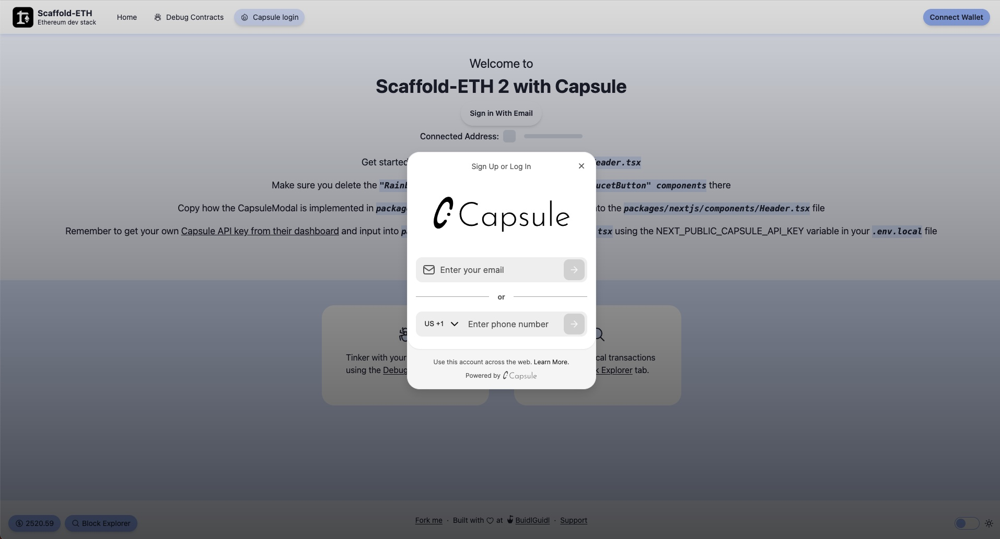

# Capsule extension



This Scaffold-ETH 2 extension comes pre-configured with [Capsule](https://usecapsule.com/) for email and SMS login with MPC, providing an example to help you get started quickly. Follow the steps below to set up and start using the extension.

## Installation

1. Create a new project with the Capsule extension:

```bash
npx create-eth@latest -e tantodefi/capsule-extension
```

## Documentation

For more detailed information and usage visit: https://docs.usecapsule.com/getting-started/initial-setup/web-modal-and-sdk-setup

## Notes

- follow flexy on [x/twitter](https://twitter.com/usecapsule
- follow me on [x/twitter](https://x.com/tantodefi)
